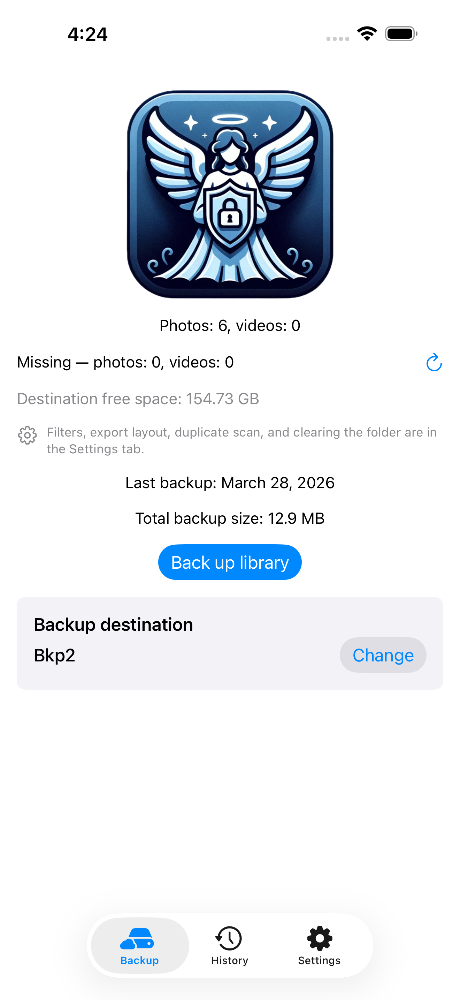
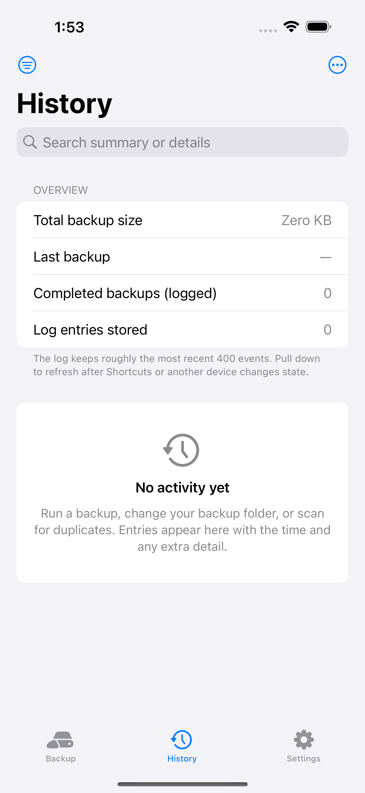
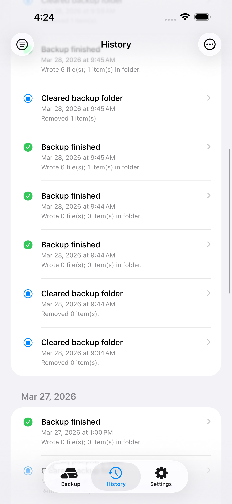
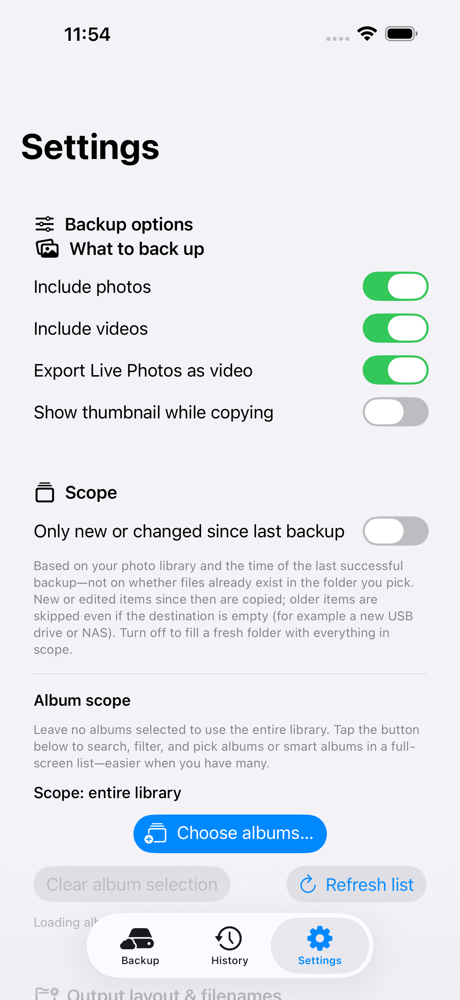
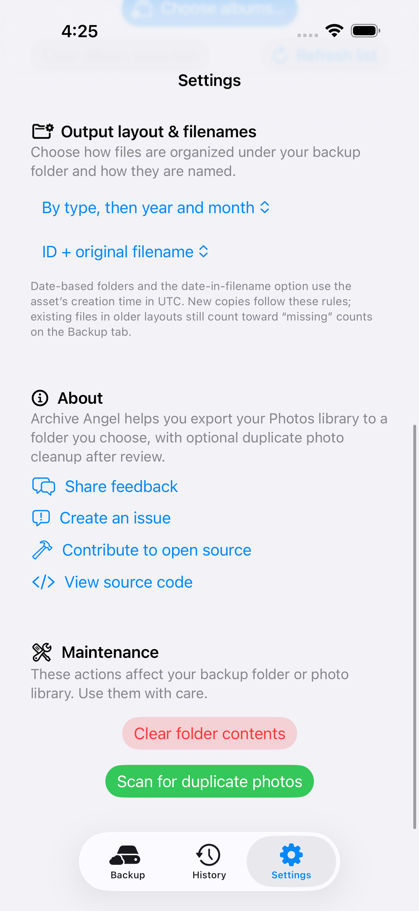
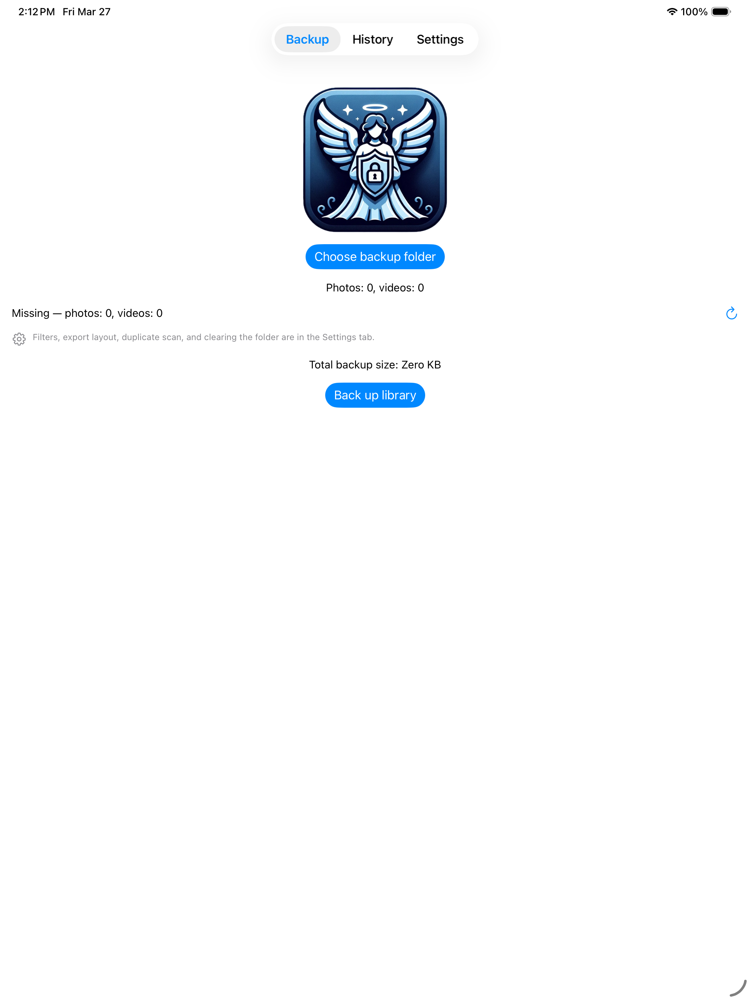
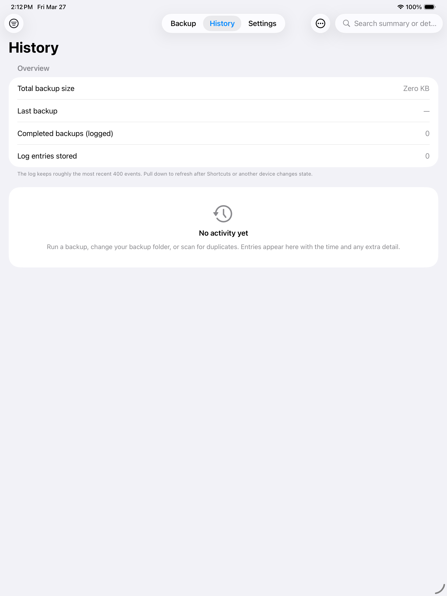
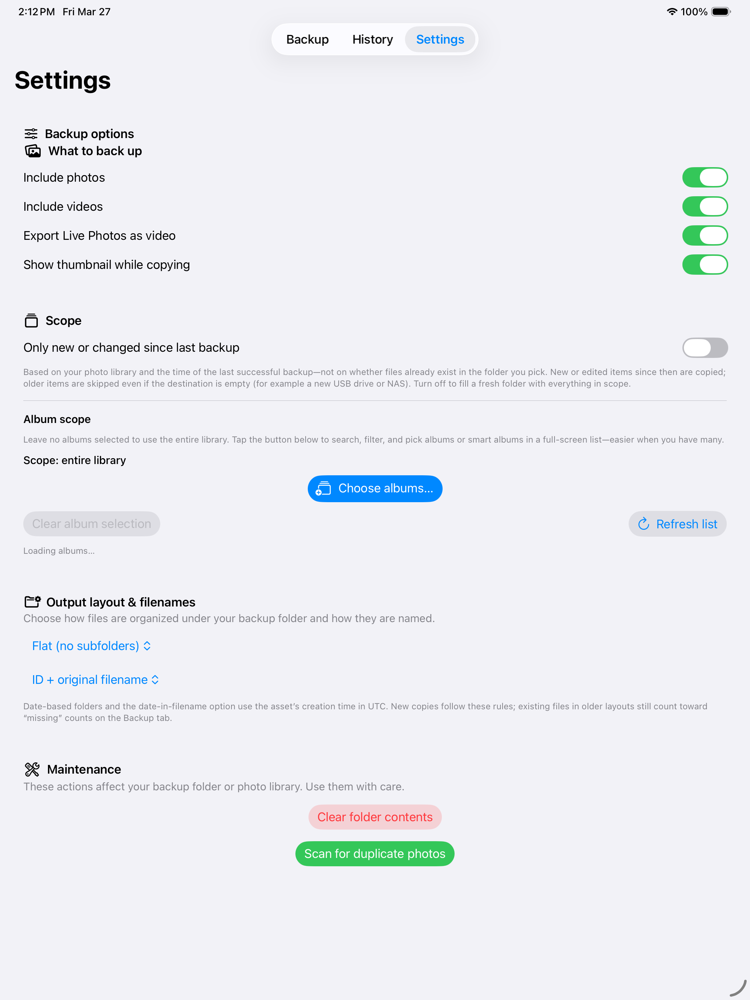
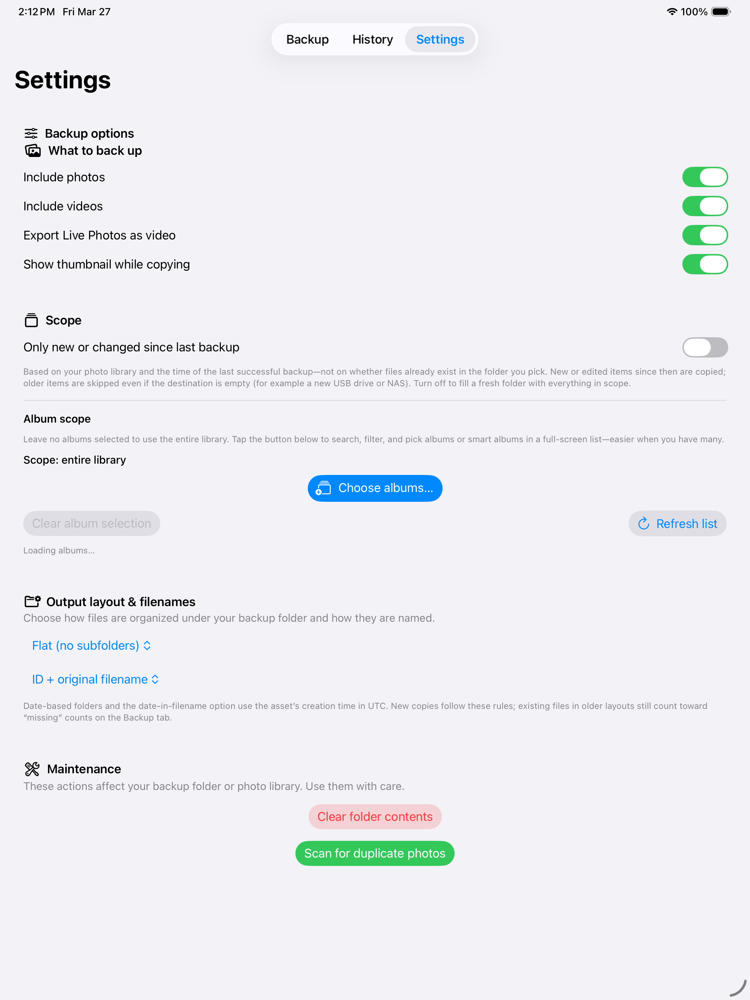

# Archive Angel

SwiftUI app for **iPhone and iPad** that exports your Photos library to a folder you pick (including iCloud-backed assets when the system downloads them), shows progress, and can **find duplicate photos** by content hash before you confirm deletion. **macOS is not a supported target** in the current codebase (UIKit document picker and iOS app shell).

[](https://www.buymeacoffee.com/archiveangel)

## Features

- **Backup** — Copies images and/or videos into a user-selected directory; skips files that already exist; optional Live Photo companion `.mov`; preserves creation/modification dates on exported files. You can choose **folder structure** (flat, by UTC date, by photos vs videos, or combined) and **filename pattern** (ID + original name, date prefix, or ID + extension).
- **Progress** — Linear progress by number of library items that match your filters; optional thumbnail while copying; cancel anytime.
- **Folder bookmark** — The backup location is stored as a bookmark in on-disk app state so it can be restored after relaunch (you may need to re-pick the folder if the bookmark goes stale).
- **State on disk** — Preferences and backup stats live in Application Support as JSON (`ArchiveAngel/app_state.json`), with a one-time migration from legacy `UserDefaults` keys. A separate **SQLite export index** (`ArchiveAngel/export_index.sqlite`) tracks which photo/video `localIdentifier`s already appear in the current backup folder under the current layout and filename pattern, so “missing” counts and disk estimates stay fast without scanning every file for every asset on each refresh.
- **Index when things change** — If you change the backup folder bookmark, folder structure, or filename pattern, the app detects a stale index, explains it on the Backup tab, and **reindexes** the destination folder in place (progress text while scanning). If indexing fails, the app falls back to a slower per-asset filesystem check and shows an alert.
- **Clear folder** — Removes **contents** of the backup folder only (keeps the folder node and security-scoped access pattern).
- **Duplicate photos** — Scans **images only** (SHA-256 of image data); videos are not scanned. After a scan, you confirm before anything is deleted from the library.
- **Siri & Shortcuts (iOS 16+)** — App Intent **“Run backup to last folder”** opens the app and runs the same backup as the in-app button, using your saved folder bookmark and settings. Find it under the app in Shortcuts, or say e.g. “Run backup in Archive Angel” (phrase depends on your app display name).
- **History tab** — Overview of total backup size, last backup time, and counts from the log; chronological **activity log** (backups, folder changes, clears, duplicate scans/deletes, Shortcuts runs). Stored under `ArchiveAngel/activity_log.json` (newest first, capped). You can clear the log without touching files or settings.
- **Settings tab** — Configure what to include, Live Photo export, thumbnails, folder structure and filenames, plus maintenance: clear backup folder and scan for duplicate photos.

## Requirements

- **iOS / iPadOS 15.0+** to run the app; **iOS / iPadOS 16+** for Shortcuts / App Intents discovery.
- **Xcode 15+** (project last built with Xcode 15+ toolchains)
- **Swift 5**

## Project layout

| Area | Location |
|------|----------|
| UI | `photo backup/ArchiveAngelRootView.swift` (Backup, History, Settings tabs), `ContentView.swift`, `HistoryView.swift`, `BackupSettingsView.swift` |
| View model | `photo backup/ArchiveAngelViewModel.swift` |
| Backup / clear folder | `photo backup/BackupManager.swift` |
| Dedup scan + delete | `photo backup/DeduplicationManager.swift` |
| Filenames, output layout & progress helpers | `photo backup/BackupNaming.swift`, `BackupOutputSettings.swift`, `BackupProgressMath` |
| Export index (SQLite, missing counts) | `photo backup/BackupExportIndex.swift` (`BackupExportIndexStore`, `BackupExportFilenameParser`) |
| Persistent JSON state | `photo backup/AppPersistentState.swift`, `AppStateStore.swift` |
| Activity log | `photo backup/ActivityLogEntry.swift`, `ActivityLogStore.swift` |
| Document folder picker | `photo backup/DocumentPicker.swift` |
| Shortcuts (App Intents) | `photo backup/RunBackupAppIntents.swift`, `BackupBookmarkResolver.swift` |
| Unit tests | `photo backupTests/ArchiveAngelCoreTests.swift` |

Swift **module name** for the app target is `photo_backup` (see `PRODUCT_MODULE_NAME` in Xcode).

## Build and run

1. Clone the repo: `git clone https://github.com/kchaitanya863/ArchiveAngel/`
2. Open `ArchiveAngel.xcodeproj` in Xcode.
3. Select the **Archive Angel** scheme and an iPhone or iPad simulator or device.
4. Run (**⌘R**).

### Unit tests

In Xcode: **Product → Test** for the `photo backupTests` target, or:

```bash
xcodebuild test -scheme "Archive Angel" -destination 'platform=iOS Simulator,name=iPhone 16' -only-testing:'photo backupTests'
```

Use a simulator that exists on your Mac (`xcodebuild -showdestinations`). If Xcode reports an **ambiguous destination** for `name=…`, pass a specific device id instead, e.g. `-destination 'platform=iOS Simulator,id=<UDID>'`.

## Usage (short)

1. **Select backup folder** — Grants access to a directory (often iCloud Drive or “On My iPhone”).
2. **Back up library** — Exports according to toggles (photos, videos, Live Photo as video, thumbnail).
3. **Clear folder contents** — Confirms, then deletes files inside that folder only.
4. **Scan for duplicate photos** — When finished, review the confirmation; **Delete** removes duplicate library assets (keeps one copy per identical image).
5. **Shortcuts** — After you have chosen a backup folder once in the app, add **Run backup to last folder** from the Shortcuts app (App Library → Archive Angel) or Siri. The shortcut requests photo access if needed and shows a summary when the run finishes.

## Privacy

Photo library usage is described in `photo-backup-Info.plist` (`NSPhotoLibraryUsageDescription`). The app reads the library for backup and duplicate detection; deleting duplicates uses `PHPhotoLibrary` change requests after you confirm.

## Future ideas

Possible enhancements (not committed work—prioritize as you like). Some items overlap.

### Backup & library

- **Filters** — Include or exclude screenshots, screen recordings, or other subtypes to reduce noise in the archive.
- **Sidecar metadata** — Write a small JSON (or XMP) next to each file with dates, camera, optional location (if permitted) for long-term search outside Photos.
- **Verify pass** — Optional post-run check (e.g. hash or size sample) and a short “verified” summary.
- **Bounded concurrency** — Export pipeline with a small parallel queue where safe, to speed very large libraries without blowing memory.

### Duplicate detection

- **Preview before delete** — Show duplicate groups in a grid and let the user pick which copy to keep.
- **Near-duplicates** — Optional similarity (bursts, “same moment”) beyond byte-identical hashes; higher UX and risk, needs clear labeling.
- **Scope dedup to an album** — Safer than whole-library delete when junk is known to live in one album.

### Destinations & workflows

- **Multiple named destinations** — Several saved folders (e.g. “NAS”, “Work iCloud”) with a default or last-used per shortcut.
- **Background / resume** — Use background tasks or phased work where iOS allows, with explicit “resume” behavior.
- **Share extension** — “Save to Archive Angel” from Sharesheet into the chosen backup folder (sandbox and permission design required).
- **More Shortcuts intents** — e.g. open History, trigger dedup scan, pick destination by name.

### Trust, clarity & polish

- **Dry-run** — “Would copy N, skip M” without writing (or write to a temp sandbox).
- **Export / onboarding copy** — Short first-run flow: permissions → folder → what “clear folder” vs “delete from library” means.
- **Localization** — `Localizable.strings` (or string catalogs) for non-English users.
- **Accessibility** — Full VoiceOver pass, Dynamic Type, and larger hit targets on destructive actions.

### Power users & platform

- **Export presets** — HEIC vs JPEG, quality, max video resolution caps where APIs allow.
- **Home Screen widget** — e.g. last backup date and approximate “pending” count (with sane refresh rules).
- **iPad** — Sidebar layout, keyboard shortcuts, more use of horizontal space.
- **macOS target** — Real Mac app with AppKit document APIs (today the project is iOS/iPadOS only).

### Already in the app (for context)

- Shortcuts intent **Run backup to last folder**, **History** tab with activity log, **Change** backup folder when one is already set, and file-backed **state** + **activity** JSON under Application Support.
- **Disk space** — Rough size estimate for items not yet in the backup folder, destination free space when readable, on-screen warnings when space looks tight or too small, and a confirmation sheet before starting when the estimate exceeds free space. Missing counts prefer the **SQLite export index** (updated during backup and after a full reindex when the folder or export format changes).
- **Incremental backup** — Optional “only new or changed since last backup” using the **library** and last successful backup time (not “missing from this folder”), so switching to a new destination only exports items added or edited after that time; turn off for a full copy to an empty folder.
- **Album scope** — Limit backup, missing counts, and disk estimates to selected user albums and smart albums (e.g. Favorites); leave none selected for the whole library.

## Contributing

Issues and pull requests are welcome. Keep changes focused; match existing Swift style and update tests when changing logic that is covered by `ArchiveAngelCoreTests`.

## Acknowledgements

- SwiftUI  
- Photos, AVFoundation, UIKit  

## Screenshots

PNG files are generated by UI tests. Run `./scripts/capture-store-screenshots.sh` from the repo root (requires Xcode). Defaults: **iPhone 17 Pro Max** and **iPad Pro 13-inch (M4)**, each with **latest** installed Simulator OS—override with `IPHONE_SCREENSHOT_DESTINATION` / `IPAD_SCREENSHOT_DESTINATION` if needed. These line up with common **iPhone 6.7"** and **iPad 13"** App Store Connect slots.

### iPhone ([`docs/store-screenshots/iphone/`](docs/store-screenshots/iphone/))

| Backup | Backup (scroll) | History |
|:---:|:---:|:---:|
|  |  |  |

| History (scroll) | Settings | Settings (scroll) |
|:---:|:---:|:---:|
|  |  |  |

### iPad ([`docs/store-screenshots/ipad/`](docs/store-screenshots/ipad/))

| Backup | Backup (scroll) | History |
|:---:|:---:|:---:|
|  |  |  |

| History (scroll) | Settings | Settings (scroll) |
|:---:|:---:|:---:|
|  |  |  |
